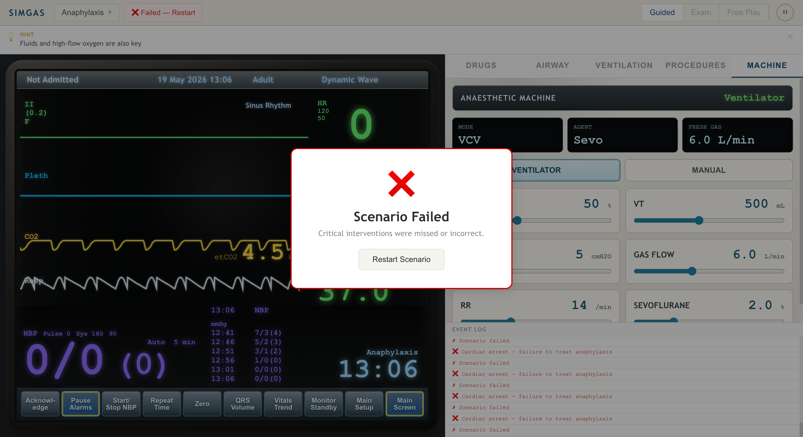

# SimGas

[](https://github.com/bsharif/simgas/actions/workflows/ci.yml)

SimGas is a browser-based anaesthetic simulation monitor for practising
peri-operative emergencies. It combines a Philips IntelliVue-inspired patient
monitor, a simulation physiology engine, drug and airway interventions, and an
anaesthetic machine control panel in a Vite, React, and TypeScript app.

> **Note:** SimGas is an educational simulation tool. It is not for clinical
> use, diagnosis, treatment, or patient monitoring.



## Features

SimGas focuses on a high-fidelity training surface rather than a generic
dashboard. The app presents clinical information in the same dense, colour-coded
style trainees see in theatre and simulation suites.

- IntelliVue-style monitor layout with dark screen, status bar, soft keys, and
  colour-coded numerics.
- Live waveform rendering for ECG, plethysmography, capnography, and respiratory
  rate.
- Dynamic vital signs for heart rate, SpO2, non-invasive blood pressure,
  end-tidal CO2, respiratory rate, temperature, and FiO2.
- Scenario progression for anaphylaxis, oesophageal intubation, and malignant
  hyperthermia.
- Intervention tabs for drugs, airway actions, ventilation changes, and
  procedures.
- Syringe-label drug buttons based on anaesthetic syringe labelling patterns.
- Anaesthetic machine panel for FiO2, tidal volume, PEEP, gas flow, respiratory
  rate, and sevoflurane concentration.
- Manual ventilation mode with a press-and-hold bag control.
- Guided, exam, and free-play modes with contextual hints and an event log.

## Screens and workflow

The app starts with a scenario picker. You select a case and simulation mode,
then start the scenario to enter the monitor and intervention workspace.

The simulation screen has two main areas:

- The left side shows the patient monitor, waveforms, NBP history, and clock.
- The right side shows intervention tabs, machine settings, hints, and the
  event log.

The monitor updates continuously from the physiology engine. Scenario checks,
drug effects, and machine setting changes all feed into the same patient state.

## Scenarios

Each scenario is a Markdown file under `/scenarios/` with YAML frontmatter
(declarative phase machine) and a body (debrief content shown after the
scenario ends). The engine compiles the frontmatter into a phase state machine
at load time — authors don't need to touch TypeScript.

| Scenario | Focus | Expected actions |
| --- | --- | --- |
| Anaphylaxis | Hypotension, tachycardia, and falling SpO2. | Give adrenaline, increase oxygen, and give fluids. |
| Oesophageal intubation | Falling ETCO2 and hypoxia after intubation. | Recognise tube misplacement, extubate, and re-intubate. |
| Malignant hyperthermia | Rising ETCO2, temperature, and heart rate. | Give dantrolene, stop volatile agent, and hyperventilate. |

### Authoring a scenario

Drop a new `.md` file into `/scenarios/`. The frontmatter shape:

```yaml
---
id: my-scenario
label: My Scenario
description: One-line summary shown on the StartPage.
difficulty: medium               # easy | medium | hard

initial_state:                    # snap values once at start
  hr: 120
  spo2: 92

initial_baseline:                 # initial drift targets
  hr: 130
  spo2: 88

phases:
  - id: onset
    baseline: { hr: 130 }         # vitals drift toward these
    events:
      - at: 10s
        text: "⚠ Something is happening"

  - id: recovery
    enter_when: "any('adrenaline-*')"
    baseline: { hr: 85 }
    resolve_when: "phase_elapsed > 60"
    resolve_events: ["✓ Stabilised"]
    resolve_snap: { hr: 78 }       # final state, applied instantly

  - id: untreated
    enter_when: "time > 30 && !any('adrenaline-*')"
    baseline: { hr: 155 }
    fail_when: "phase_elapsed > 60"
    fail_events: ["❌ Cardiac arrest"]
    fail_snap: { ecgRhythm: asystole }

hints:
  - "Top-level hints shown in Guided mode"
---

# Debrief title

Markdown body shown in the post-scenario debrief view.
```

Phase selection: **last matching `enter_when` wins** — list phases from
least- to most-specific. Predicate functions: `any('id-glob')`,
`count('id')`, `phase_done('id')`. Variables: `time`, `phase_elapsed`, `hr`,
`spo2`, `etco2`, `rr`, `temp`, `tube_position`. Operators: `&& || ! == != < <= > >=`.

Validate before committing: `npm run lint:scenarios` checks schema,
intervention references, and that every scenario can terminate.

## Monitor details

The monitor is designed to resemble a Philips IntelliVue screen while remaining
fully synthetic and browser-rendered.

- ECG is generated from Gaussian P, Q, R, S, and T components.
- Pleth is generated from the heart rate and saturation value.
- ETCO2 uses a respiratory cycle and supports capnography-like plateau shapes.
- Respiration uses a separate synthetic respiratory waveform.
- NBP readings are derived from scenario state and displayed as current and
  recent readings.

Waveform buffers use `Float32Array` ring buffers, with a shared write position
stored on the patient state.

## Anaesthetic machine

The Machine tab provides controls for core ventilator and gas delivery settings.
These controls update the shared simulation state.

- `FiO2`: oxygen fraction, displayed as a percentage.
- `VT`: tidal volume in millilitres.
- `PEEP`: positive end-expiratory pressure in cmH2O.
- `Gas Flow`: fresh gas flow in litres per minute.
- `RR`: respiratory rate in breaths per minute.
- `Sevoflurane`: volatile agent concentration as a percentage.

Manual mode switches the display from volume-controlled ventilation to a manual
bag control. Press and hold the bag to simulate manual ventilation.

## Drug controls

Drug buttons use syringe-label styling so the visual language is closer to
anaesthetic practice.

- Adrenaline uses a black and violet split label.
- Metaraminol and ephedrine use vasopressor violet labels.
- Propofol uses an induction-drug yellow label.
- Dantrolene uses a neutral high-contrast label.

The labels are visual cues for simulation only. Users must still read the drug
name and dose before applying an intervention.

## Project structure

The codebase separates simulation logic from React UI. The engine imports no UI
code, which keeps the physiology model portable.

```text
engine/
  interventions.ts        Intervention definitions and state modifiers
  patient.ts              Patient state, normal ranges, and baseline state
  physiology.ts           Simulation engine and animation loop
  scenario.ts             Scenario interfaces
  scenarios/              Scenario implementations
  waveforms.ts            Synthetic waveform generators

ui/
  components/Monitor/     Monitor layout and waveform canvases
  components/RightPanel/  Intervention and machine controls
  context/                React bridge to the simulation engine
  pages/                  Start and simulation screens
```

## Requirements

You need Node.js and npm installed. The project was built with the versions
declared in `package.json` and `package-lock.json`.

## Run locally

Use npm to install dependencies and start the Vite dev server.

```bash
npm install
npm run dev
```

Open the local URL printed by Vite, usually `http://127.0.0.1:5173/`.

## Validate changes

Run these checks before committing changes.

```bash
npm run build
npm run lint
npm test
```

`npm run build` runs TypeScript checking through `tsc -b`, then builds the Vite
bundle. `npm test` runs the engine tests with Vitest.

## Development notes

The engine mutates `PatientState` in place on each animation tick, then the
React context publishes a shallow state copy to trigger rendering. Waveform
arrays are reused rather than reallocated.

When you add new simulation features:

- Add patient fields to `engine/patient.ts`.
- Add scenario or intervention modifiers in `engine/interventions.ts`.
- Keep waveform generation pure in `engine/waveforms.ts`.
- Expose UI actions through `ui/context/SimulationContext.tsx`.
- Add controls in `ui/components/RightPanel/RightPanel.tsx` when users need to
  interact with the setting.

## Project workflow

Branching conventions:

- `fix/*` — bug fixes
- `feat/*` — new features
- `chore/*` — tooling, CI, dependencies, dead-code removal
- `refactor/*` — internal restructuring without behaviour change
- `docs/*` — documentation only

Each branch opens one PR. PRs are squash-merged into `main` after CI passes. Phase
boundaries are tagged `v0.X.0` (`git tag -a v0.X.0 -m "..."`).

CI (`.github/workflows/ci.yml`) runs `npm run lint`, `npm run test`, and
`npm run build` on every PR and on every push to `main`.

A pre-commit hook (via `simple-git-hooks`) runs `npm run lint` and
`npm run typecheck` locally before each commit. The hook is installed
automatically after `npm install` (via the `prepare` script). To bypass in an
emergency: `SKIP_SIMPLE_GIT_HOOKS=1 git commit ...`.

## License and attribution

The syringe labelling reference PDF is included for local design reference. The
app uses synthetic data and does not contain patient-identifiable information.

## Roadmap

The full plan for the next iteration is tracked in
[`docs/superpowers/plans/`](docs/superpowers/plans/). In summary:

- **v0.2.0 — Engine + UI bug fixes:** pause respect, persistent rAF, drift-baseline
  scenarios so drug effects actually persist, tube-position state for the
  oesophageal-intubation scenario, hint timing, first-class scenario phase.
- **v0.3.0 — Scenario DSL:** YAML frontmatter + markdown body, predicate
  mini-language, interpreter, lint CLI. Authors no longer need TypeScript.
- **v0.4.0 — Configurable monitor + extras:** runtime-toggleable traces (ECG,
  pleth, capnography, Art line, CVP, BIS), dose tracking with cooldown, Web
  Audio alarms with priority escalation, post-scenario debrief view.
- **v0.5.0 — Realtime multi-user:** Supabase Realtime rooms with instructor /
  learner / observer roles, leader-server hybrid model, deterministic local
  waveform regeneration (no waveform-buffer broadcasting).
